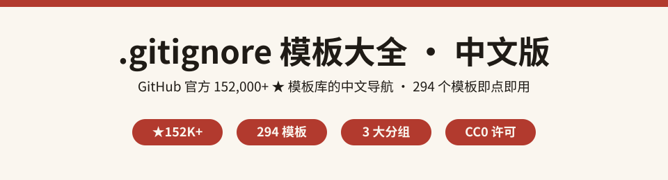
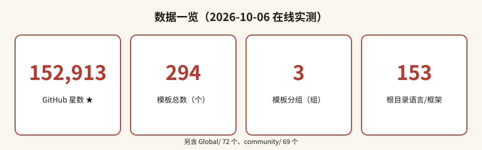
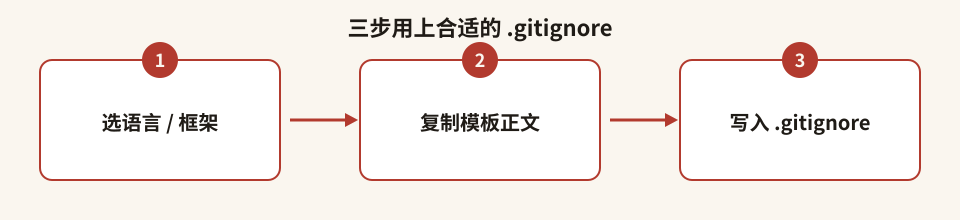

<p align="center">
  
</p>

<h1 align="center">gitignore-zh · .gitignore 模板大全（中文导航）</h1>

<p align="center">
  基于 GitHub 官方 <b>152,000+ ★</b> 的 <b>github/gitignore</b>，收录 <b>294 个</b> 语言 / 框架 / IDE / 操作系统模板，一份中文索引帮你 30 秒找到最合适的忽略规则。
</p>

<p align="center">
  
  
  
  
  
</p>

---

## 目录

- [这是什么](#这是什么)
- [为什么值得收藏](#为什么值得收藏)
- [数据一览](#数据一览)
- [快速开始](#快速开始)
- [分类清单（高频精选）](#分类清单高频精选)
- [全量索引](#全量索引)
- [完整数据与出处](#完整数据与出处)
- [常见问题 FAQ](#常见问题-faq)
- [参与贡献](#参与贡献)
- [致谢](#致谢)
- [许可声明](#许可声明)

---

## 这是什么

`gitignore-zh` 是 [github/gitignore](https://github.com/github/gitignore) 的**中文导航仓库**。

源仓库由 GitHub 官方维护，是全球开发者创建项目时首选的 `.gitignore` 模板来源，目前已获得 **152,913 ★**。但它本身是纯英文、扁平结构的数百个模板文件，中文用户常常不知道「我该用哪个」「模板放在哪」。

本仓库不搬运模板正文，只做一件事：**把 294 个模板按语言 / 框架 / IDE / 操作系统重新整理成一份可读的中文索引**，并为每一个模板附上直达源仓的链接，让你点开即用。

## 为什么值得收藏

- **找得快**：按「语言 → 框架 → IDE → 操作系统」分层，不再在几百个文件里翻目录。
- **不重复造轮子**：直接链到 GitHub 官方模板，规则由全球社区持续维护，永远最新。
- **合规干净**：源仓是 CC0-1.0（公共领域），本仓索引以 MIT 发布，可自由复用。
- **数据真实**：星数、模板数、分类数均为在线实测，不是拍脑袋的营销数字。

## 数据一览

<p align="center">
  
</p>

| 指标 | 数值 | 说明 |
| --- | --- | --- |
| 源仓星数 | **152,913 ★** | github/gitignore，GitHub API 实测 |
| 模板总数 | **294** | 含全部子目录的 `*.gitignore` |
| 根目录模板 | **153** | 语言 / 框架 / 运行时主模板 |
| Global/ 模板 | **72** | IDE / 编辑器 / 操作系统全局忽略 |
| community/ 模板 | **69** | 社区贡献模板（PHP 8、JavaScript 5、embedded 4、DotNet 4…） |

> 统计口径：通过 jsDelivr flat 文件清单递归统计 `*.gitignore`，核实日期 **2026-10-06**。

## 快速开始

<p align="center">
  
</p>

1. **选语言 / 框架**：在下方分类表或[全量索引](templates-index.md)里找到你的技术栈。
2. **下载模板正文**：点击索引中的链接，跳转到源仓对应文件，复制内容。
3. **放入仓库根目录**：保存为你项目根目录下的 `.gitignore`，按需追加自己的规则即可。

```bash
# 示例：Python 项目
# 1. 打开 https://github.com/github/gitignore/blob/main/Python.gitignore
# 2. 复制内容，写入项目根目录：
#    $ cp Python.gitignore 你的项目/.gitignore
# 3. 按需组合 Global/ 里的编辑器模板，例如 JetBrains / macOS
```

## 分类清单（高频精选）

> 完整 294 个模板见 [templates-index.md](templates-index.md)。

| 分类 | 代表模板 | 直达链接 |
| --- | --- | --- |
| **Python** | `Python.gitignore` | [打开](https://github.com/github/gitignore/blob/main/Python.gitignore) |
| **Node.js / 前端** | `Node.gitignore` / `Nextjs.gitignore` / `Nestjs.gitignore` / `community/JavaScript/Vue.gitignore` | [Node](https://github.com/github/gitignore/blob/main/Node.gitignore) |
| **Java / JVM** | `Java.gitignore` / `Gradle.gitignore` / `Maven.gitignore` / `Kotlin.gitignore` / `Scala.gitignore` | [Java](https://github.com/github/gitignore/blob/main/Java.gitignore) |
| **Go** | `Go.gitignore` / `community/Golang/Hugo.gitignore` | [Go](https://github.com/github/gitignore/blob/main/Go.gitignore) |
| **Rust** | `Rust.gitignore` | [打开](https://github.com/github/gitignore/blob/main/Rust.gitignore) |
| **C / C++** | `C.gitignore` / `C++.gitignore` / `CMake.gitignore` | [C++](https://github.com/github/gitignore/blob/main/C%2B%2B.gitignore) |
| **Web 框架** | `Rails.gitignore` / `Laravel.gitignore` / `Symfony.gitignore` | [Rails](https://github.com/github/gitignore/blob/main/Rails.gitignore) |
| **移动 / 跨端** | `Android.gitignore` / `Swift.gitignore` / `Flutter.gitignore` / `Unity.gitignore` | [Flutter](https://github.com/github/gitignore/blob/main/Flutter.gitignore) |
| **.NET** | `Dotnet.gitignore` / `VisualStudio.gitignore` / `community/DotNet/core.gitignore` | [VisualStudio](https://github.com/github/gitignore/blob/main/VisualStudio.gitignore) |
| **IDE / 编辑器** | `Global/JetBrains.gitignore` / `Global/VisualStudioCode.gitignore` / `Global/Vim.gitignore` / `Global/Emacs.gitignore` | [JetBrains](https://github.com/github/gitignore/blob/main/Global/JetBrains.gitignore) |
| **操作系统** | `Global/macOS.gitignore` / `Global/Windows.gitignore` / `Global/Linux.gitignore` | [macOS](https://github.com/github/gitignore/blob/main/Global/macOS.gitignore) |
| **运维 / IaC** | `Terraform.gitignore` / `community/OpenTofu.gitignore` / `Packer.gitignore` | [Terraform](https://github.com/github/gitignore/blob/main/Terraform.gitignore) |

## 全量索引

完整模板清单（按「根目录语言/框架 → Global → community」三组排列，共 294 条，每条附源仓直达链接）见：

👉 **[templates-index.md](templates-index.md)**

## 完整数据与出处

- **源项目**：[github/gitignore](https://github.com/github/gitignore)
- **维护方**：GitHub 官方组织（`github`）
- **默认分支**：`main`
- **星数**：152,913 ★（GitHub REST API 实测，2026-10-06）
- **模板总数**：294（递归统计 `*.gitignore`）
- **顶层结构**：根目录语言/框架模板 153 个 + `Global/` 72 个 + `community/` 69 个（另有 `.github/` 为 CI 配置目录）
- **源仓许可**：CC0-1.0（Creative Commons Zero v1.0 Universal，公共领域）

## 常见问题 FAQ

**Q1：这个仓库里有 `.gitignore` 的正文吗？**
没有。本仓只做中文导航与索引，模板正文全部链向 github/gitignore 源文件，避免内容过期、也避免与官方维护脱节。

**Q2：我可以直接复制官方模板用在自己项目里吗？**
可以。源仓采用 CC0-1.0，是最宽松的公共领域许可，个人 / 商业项目均可自由复制、修改、分发，无需署名（建议署名以表尊重）。

**Q3：一个项目需要几个模板？**
通常「1 个语言/框架模板 + 按需叠加 IDE/操作系统全局模板」即可。例如 Python 项目用 `Python.gitignore`，再叠加 `Global/JetBrains.gitignore` 与 `Global/macOS.gitignore`。

**Q4：为什么数字和 GitHub 页面看到的不完全一样？**
星数会随时间增长，本仓数字为 2026-10-06 在线实测快照；模板数随官方新增而变化，以源仓实时为准。

**Q5：本仓和源仓是什么关系？**
非官方、非 fork 的中文导航镜像（索引层）。源仓仍由 GitHub 官方维护，所有模板内容的版权与维护责任归源项目所有。

## 参与贡献

本仓是索引层。如果你发现：
- 分类归类不合理、中文译名不准确；
- 想补充某个高频模板的「使用场景说明」；

欢迎提 Issue 或 PR。模板正文本身的修改请前往 [github/gitignore](https://github.com/github/gitignore) 按其 CONTRIBUTING 流程提交。

## 致谢

感谢 GitHub 官方与全球社区维护的 [github/gitignore](https://github.com/github/gitignore) —— 这是每个开发者都受益的基础设施。本中文索引站在巨人的肩膀上。

## 许可声明

- **本仓库（gitignore-zh 索引与文档）**：以 [MIT 许可证](LICENSE) 发布，Copyright (c) 2026 zieang88888。
- **模板内容（来自 github/gitignore）**：以 [CC0-1.0](https://github.com/github/gitignore/blob/main/LICENSE) 发布，进入公共领域。
- 第三方署名与统计口径详见 [THIRD_PARTY_NOTICES.md](THIRD_PARTY_NOTICES.md)。
